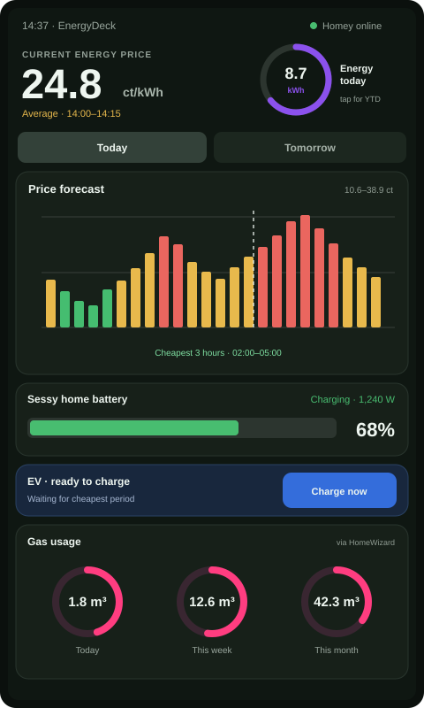

# EnergyDeck



EnergyDeck is a local energy dashboard for the ELECROW CrowPanel Advance 5.0
(`DIS02050A001`) and Homey Pro 2023.

The dashboard is designed to show:

- quarter-hour electricity prices for today and tomorrow;
- current and historical electricity consumption;
- Sessy state of charge, charging direction and power;
- gas consumption from HomeWizard;
- live go-eCharger connection, charging and completion status;
- a button that starts the existing Homey EV charging Flow.

## Status

The ESPHome/LVGL simulator and physical CrowPanel firmware are available at
480 x 800 pixels. The build targets the common V1.2/V1.3 pinout, connects over
Wi-Fi and reads Homey successfully. Large HTTP responses use the ESP32-S3's
8 MB PSRAM; display orientation, colors and touch alignment are confirmed
visually after the first upload.

## Connect the CrowPanel on macOS

The CrowPanel Advance 5.0 is supplied with a USB-A to USB-C data cable. A Mac
with USB-C ports only therefore needs one of these connections:

- preferably, the supplied cable through a USB-C to USB-A adapter or hub;
- alternatively, a USB-C to USB-C cable that explicitly supports data transfer.

A charge-only cable can power the display but cannot be used to upload
firmware. Connect the cable directly where possible and check that the power
indicator or display turns on.

### Check whether macOS sees the USB interface

Before installing or uploading anything, inspect the available serial ports:

```sh
ls -1 /dev/cu.*
```

The CrowPanel used for this project first appeared in macOS as `USB Serial`
with USB vendor/product ID `1a86:7522`. If `USB Serial` is visible in System
Information but no new `/dev/cu.*` entry appears, macOS can see the hardware
but its CH34x serial driver is missing.

Install the official
[WCH CH34x driver for macOS](https://www.wch.cn/downloads/CH34XSER_MAC_ZIP.html).
After installation, macOS may show the driver as `activated waiting for user`.
In that case, open **System Settings → General → Login Items & Extensions →
Driver Extensions** and enable **CH34xVCPDriver / WCH**. Confirm with the Mac
password or Touch ID when requested. Also check **System Settings → Privacy &
Security** if macOS displays an approval message there. Restart the Mac if the
installer or System Settings requests it, then disconnect and reconnect the
display. A port with a name similar to `/dev/cu.wchusbserial...` should appear.

If neither `USB Serial` nor a serial port appears:

1. try the supplied cable and another USB-C adapter or hub;
2. try another physical USB port on the Mac;
3. verify that the display receives power;
4. disconnect and reconnect the display.

### Enter download mode

Only use download mode when EnergyDeck is ready to be flashed:

1. keep the display connected over USB;
2. hold the `BOOT` button (on some revisions this is the power/boot button);
3. press and release `RST` while continuing to hold `BOOT`;
4. release `BOOT` after a second;
5. check the serial port again.

Do not upload firmware until the hardware revision printed on the PCB has been
checked. ELECROW has released revisions V1.0 through V1.3, and backlight/button
control differs between revisions. The factory firmware remains intact until
an upload is deliberately started.

The official hardware details and examples are in ELECROW's
[CrowPanel Advance 5.0 repository](https://github.com/Elecrow-RD/CrowPanel-Advance-5-HMI-ESP32-S3-AI-Powered-IPS-Touch-Screen-800x480)
and [product wiki](https://elecrow.com/wiki/CrowPanel_Advance_5.0-HMI_ESP32_AI_Display.html).

The display can draw considerably more power once the panel and backlight are
active. If it resets or goes black during hardware testing, use a stable 5 V / 2 A
power source as recommended by ELECROW while keeping the programming connection.

### Back up the factory firmware

Create a full backup before the first EnergyDeck upload. The helper reads the
16 MB flash in retryable 1 MB blocks, which is more reliable with USB adapters
than one long transfer:

```sh
./.venv/bin/python scripts/backup_factory_flash.py \
  --port /dev/cu.wchusbserial110 \
  --baud 230400 \
  --output backups/crowpanel-factory-16mb.bin
```

Replace the port when macOS assigns a different name. Do not disconnect or
reset the panel while a block is being read. Completed blocks are retained, so
the same command can safely resume after a failed transfer. On success it must
report `16777216 bytes` and prints a SHA-256 checksum. The `backups` directory
and `*.bin` files are excluded from Git because a factory image may contain
device-specific settings.

The first backup made from this project has SHA-256:

```text
92de6d3f4b9d5cc95f655dcf08f5a2c42bdb85b079f889f705bcfebd37e4c60d
```

Keep a second copy of the resulting file outside the repository. Restoring it
overwrites the complete panel flash and should only be done deliberately, with
the exact 16 MB backup belonging to this device.

### Build and upload EnergyDeck

Add the panel's 2.4 GHz Wi-Fi credentials to the local `.env` file:

```dotenv
ENERGYDECK_WIFI_SSID=your-wifi-name
ENERGYDECK_WIFI_PASSWORD=your-wifi-password
```

Compile the physical configuration without touching the panel:

```sh
set -a
source .env
set +a
./.venv/bin/esphome compile esphome/energydeck-crowpanel.yaml
```

For the first wired upload, put the panel in download mode and run:

```sh
set -a
source .env
set +a
./.venv/bin/esphome run esphome/energydeck-crowpanel.yaml \
  --device /dev/cu.wchusbserial110
```

Replace the device path if necessary. Later updates can be sent over Wi-Fi to
`energydeck.local`. Keep the USB connection in place for the first boot log so
display, I²C backlight controller and GT911 touch detection can be checked.

After filling `.env`, build, upload and follow the boot log with:

```sh
./flash.sh
```

The script reads `.env` without executing it as shell code, so wifi passwords
containing spaces or special characters are supported. Pass a different serial
port as the first argument when necessary, for example
`./flash.sh /dev/cu.wchusbserial210`.

## Simulator

Requirements on macOS:

- ESPHome
- SDL2
- libsodium

Start from the project directory:

```sh
./run.sh
```

The script creates the local ESPHome environment automatically when needed.
Stop the simulator with `Ctrl+C`.

The simulator loads live quarter-hour prices from the `EnergyDeck Prices`
Homey Logic variable when `.env` is configured. The current price, 96 bars,
daily minimum/maximum and cheapest consecutive three-hour window refresh every
five minutes. The header shows live electricity use today, current net power and
the day's peak power from HomeWizard/Homey. Sessy's state of charge,
charge/discharge direction, go-eCharger state, live electricity and solar power
are read in one serialized 20-second cycle. Only one large Homey response is
kept in memory at a time; when no vehicle is connected, the charge button is
disabled. Day totals and the day peak refresh every five minutes;
solar day yield and gas totals refresh every five minutes. The market prices are
converted to an all-in household price using the configured energy tax, VAT and
supplier purchasing fee. The defaults match the Netherlands and Zonneplan in
2026 and can be overridden in `.env`.

## Connect Homey

With Homey configured, EnergyDeck reads live grid power, daily electricity use,
Sessy status, live solar power and today's solar yield. The gas rings show exact
totals for today, this month and this year.

Run the safe connection check with:

```sh
./homey-setup.sh
```

An interactively entered token is not stored. See [Homey integration](docs/HOMEY.md)
for token creation and the next steps.

The Homey address and token can also be placed in the local `.env` file. Use
`.env.example` as a reference. `.env` is never committed to GitHub.

### Create the correct Homey API Key

EnergyDeck needs a local **Homey API Key**. This is the Personal Access Token
used as a Bearer token by Homey's local Web API. Do not create an OAuth client,
Client ID, Client Secret or an app-specific key.

1. Open [Homey Web App](https://my.homey.app/) on a computer and sign in.
2. Select the Homey Pro that will be connected to EnergyDeck.
3. Open **Settings → API Keys**.
4. Click **New API Key**.
5. Name it `EnergyDeck`.
6. Select only these permissions:
   - **Devices — Read only** (`homey.device.readonly`)
   - **Flows — Read only** (`homey.flow.readonly`)
   - **Flows — Start** (`homey.flow.start`)
   - **Logic / Variables — Read only** (`homey.logic.readonly`)
   - **Location — Read only** (`homey.geolocation.readonly`)

   In the Dutch Homey interface, select only the indented permissions:
   - **Apparaten weergeven**
   - **Flows weergeven**
   - **Flows starten**
   - **Variabelen weergeven**
   - **Locatie weergeven**

   Do not select the blue parent checkboxes **Apparaten**, **Flows** or
   **Variabelen**. A parent checkbox grants the complete group, including
   permissions such as **Apparaten besturen** that EnergyDeck does not need.
7. Click **Create** and copy the key immediately. Homey only shows it once.
8. Place it in the local `.env` file:

   ```env
   HOMEY_ADDRESS=http://192.168.1.100
   HOMEY_TOKEN=paste_the_api_key_here
   ```

Use the actual local IP address of Homey Pro. Keep the key private. It can be
revoked at any time under **Settings → API Keys**.

> Homey currently does not offer a separate Energy permission in the API Key
> screen, even though the Web API documents `homey.energy.readonly`. EnergyDeck
> therefore does not require full Homey access. A HomeyScript will copy Homey's
> internal quarter-hour prices to a read-only Logic variable instead.

## Weather and development

The simulator and physical display use Dutch by default, with English strings
available in `esphome/translations/en.yaml`. The weather card includes a two-hour
Buienradar rain graph and an Open-Meteo temperature outlook for three hours ahead.
See [weather data and refresh details](docs/RAIN.md).

Repository working agreements, including creating a descriptive local commit
after each completed change, are documented in [AGENTS.md](AGENTS.md).

## Secrets

Later, copy `esphome/secrets.example.yaml` to `esphome/secrets.yaml` and fill in
the values locally. Git ignores `secrets.yaml`.
